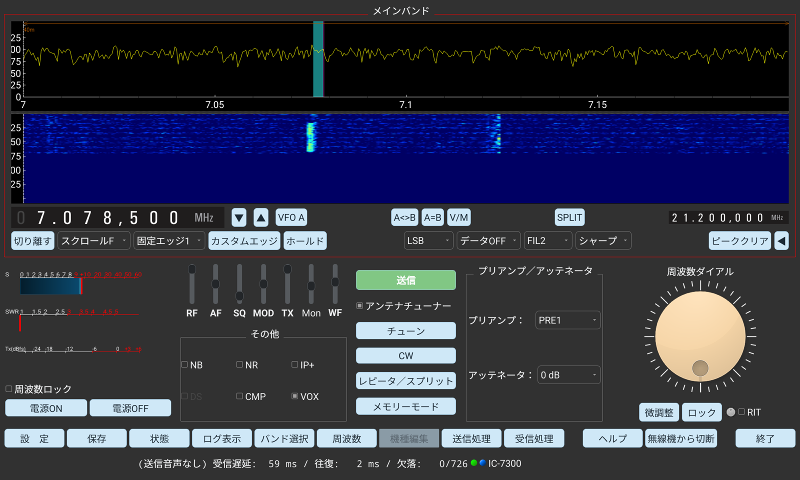

# wfview4android タブレット版 操作説明書

**wfview4android** は、CI-V 対応のリグ用コントロールソフト **wfview** の Android 移植版（非公式フォーク）です。
Icom の LAN 対応リグ本体（IC-705 / IC-9700 / IC-7610 など）、または Raspberry Pi / PC で動作する **wfserver**（IC-7300 などを LAN 化）へ Wi-Fi で接続し、
スペクトラム／ウォーターフォールを見ながら、同調・送受信・音声処理をタブレットから操作できます。

- **対象端末**: Android 9 以降の Android タブレット（arm64-v8a）。画面の解像度・縦横比に自動で追従します
- **画面の向き**: 横向き（ランドスケープ）全画面
- **接続方式**: ネットワーク（Icom LAN プロトコル）のみ。USB／シリアル接続には対応していません
- スマートフォン向けには、iPhone 版と同じタブ式の画面にした **携帯版（wfview phone）** があります（→ [携帯版について](#sec-phone)）

本リポジトリは [wfview](https://wfview.org/)（GPLv3）の非公式フォークです。本家プロジェクトとは無関係の個人移植であり、不具合報告は本家ではなく本リポジトリへお願いします。

---

## 目次

1. [ダウンロードとインストール](#sec-1)
2. [起動と接続](#sec-2)
3. [画面全体の構成](#sec-3)
4. [周波数の操作](#sec-4)
5. [スペクトラム／ウォーターフォール（スコープ）](#sec-5)
6. [メーター（S / SWR / Tx レベル）](#sec-6)
7. [操作ボタン（電源・送信・チューンなど）](#sec-7)
8. [受信を整える（その他・プリアンプ／アッテネータ・スライダー）](#sec-8)
9. [CW 解読（CW デコード）](#sec-9)
10. [ポップアップ画面と「← 戻る」ボタン](#sec-10)
11. [レピータ／スプリット](#sec-11)
12. [メモリーモード](#sec-12)
13. [CW 送信](#sec-13)
14. [送信処理／受信処理（音声処理）](#sec-14)
15. [モードの選び方](#sec-15)
16. [基本操作の流れ（クイックスタート）](#sec-16)
17. [こんなときは（トラブルシューティング）](#sec-17)
18. [注意事項](#sec-18)
19. [携帯版について](#sec-phone)
20. [ライセンス](#sec-license)
21. [ビルド（開発者向け）](#sec-build)

---

## 1. ダウンロードとインストール

Google Play では配布していません。リリースページの APK を直接インストールします。

| 版 | ファイル | 対象 |
|----|----------|------|
| タブレット版 2026.10.10 | [wfview4android-tablet-2026.10.10.apk](https://github.com/kazushinjo/wfview_android-tablet/releases/download/v2026.10.10/wfview4android-tablet-2026.10.10.apk) | Android タブレット |
| 携帯版 2026.10.10 | 携帯版のリリースページから入手（→ [携帯版について](#sec-phone)） | Android スマートフォン |

すべてのリリースは [リリースページ](https://github.com/kazushinjo/wfview_android-tablet/releases) にあります。
（本リポジトリは非公開のため、ダウンロードには GitHub のアカウントとリポジトリへのアクセス権が必要です。）

1. **動作条件**: Android 9 以降（arm64-v8a）
2. APK を端末へコピーし（ダウンロード／USB／クラウドなど）、ファイルマネージャでタップします
3. 「提供元不明のアプリのインストール」の確認が出たら、使用中のアプリ（ファイルマネージャ等）に**許可**を与えます
4. 初回起動時に**マイクへのアクセス許可**を求められるので「アプリの使用時のみ」を選びます（送信音声に必要。拒否すると変調がかかりません）
5. 開発者向け: `adb install -r wfview4android-tablet-2026.10.10.apk`

> **以前の版からの入れ替えについて**
> 2026.10.10 から、リリース APK の署名を新しい鍵に切り替えました。それより前に配布した APK（別の PC でビルドした版）とは署名が違うため、
> **上書きインストールできません**。一度アンインストールしてからインストールしてください。
> アンインストールすると接続プロファイルなどの設定は消えるので、接続先（ホスト名・ポート・ユーザID・パスワード）を控えておいてください。
> 2026.10.10 以降は同じ鍵で署名するので、次の版からは上書きでき、設定も残ります。

---

## 2. 起動と接続

### 2-1. 接続先の設定

1. 画面下の **設 定** をタップして設定画面を開きます。
2. 左の一覧で **無線機との接続方法** を選び、次を入力します。
   - **ネットワーク接続**: 有効にします（本アプリは常にネットワークで接続します）
   - **ホスト名**: リグ本体または wfserver の IP アドレス（例: `192.168.1.20`）
   - **コントロールポート(UDP)**: 制御用ポート番号（既定 `50001`）
   - **ユーザID / パスワード**: wfserver（またはリグ本体のネットワーク設定）で決めた認証情報
   - **ホスト名・ユーザID・パスワード** の欄は、タップするとアプリ内のキーボードが開きます。ホスト名は数字・小数点・Back（1 文字削除）・クリアだけのテンキー（IP アドレスで入力）、ユーザID とパスワードは半角英数字のキーボード（数字・英小文字・`- . _ @`、**大文字** で切り替え、Back、クリア）です。押したそばから欄に入り、キーボードの外をタップすると閉じます。端末の日本語キーボードは使わないので、全角文字が入ることはありません
   - **受信用コーデック / 送信用コーデック / サンプルレート**: 通常は既定のままで動作します。音が途切れる回線では低いサンプルレートや Opus 系のコーデックを試してください
   - **受信遅延時間(ms) / 送信遅延時間(ms)**: 音声バッファの量（30〜1000ms）。回線が不安定で音が途切れるときは大きくすると改善しますが、その分だけ音声が遅れます
3. **設定を保存** で保存します。

設定画面にはほかに **ユーザーインターフェース**（配色・周波数の単位・CW デコードなど）、**無線機の設定**、**リモートサーバの設定**、**外部制御**、**DXクラスタの設定**、**実験内容** があります。普段の運用で触るのは「無線機との接続方法」と「ユーザーインターフェース」だけです。

### 2-2. 接続プロファイル（複数の接続先の使い分け）

- **接続プロファイル** の欄に名前（例: `自宅7300` / `山小屋wfserver`）を入れて **保存** をタップすると、リグ・ネットワーク・音声・ログインの設定一式が名前付きで保存されます。
- プルダウンから保存済みのプロファイルを選ぶと、その値が設定欄に戻ります。
- **削除** で選択中のプロファイルを消します。
- 接続を始めるときに選択中のプロファイルが読み直されるので、「プロファイルを選ぶ → 接続」だけで接続先を切り替えられます。

### 2-3. 接続と切断

- 設定画面を **← 戻る** で閉じ、画面下の **無線機に接続** をタップすると接続を始めます（接続中は「接続を中止」と表示されます）。
- 接続できるとボタンが **無線機から切断** に変わり、画面右下にリグ名が表示され、リグの機能に応じた操作部品が現れます。
- 切断するときは **無線機から切断** をタップします。

---

## 3. 画面全体の構成

| 場所 | 内容 |
|------|------|
| 最上段（CW モードのときだけ） | **CW 解読の表示帯**（→ 9章） |
| 上部 | **メインバンド**: スペクトラム＋ウォーターフォール、周波数表示、▼／▲、VFO、スコープとモードの操作 |
| 左下 | **S / SWR / Tx(dBfs) メーター**、**周波数ロック**、**電源ON / 電源OFF** |
| 中央 | スライダー（**RF / AF / SQ / MOD / TX / Mon / WF**）と **その他**（NB / NR / IP+ / DS / CMP / VOX） |
| 中央右 | **送信**（緑）、**アンテナチューナー**、**チューン**、**CW**、**レピータ／スプリット**、**メモリーモード** |
| 右 | **プリアンプ／アッテネータ** |
| 右端 | **周波数ダイアル**（白い目盛り付き）と **微調整** / **ロック** / **RIT** |
| 最下段のボタン | **設 定 / 保存 / 状態 / ログ表示 / バンド選択 / 周波数 / 機種編集 / 送信処理 / 受信処理 / ヘルプ / 無線機に接続（無線機から切断） / 終了** |
| 最下行 | 受信状態の表示:（送信音声なし）・**受信遅延**・**往復**（往復時間）・**欠落**（失われたパケット数／受信したパケット数）・接続中のリグ名 |

- ボタンはすべて角丸の薄い水色です。オンになっているボタンは少し濃い青、使えないボタンは灰色で表示されます。
- リグの検出が終わるまで、機種によって変わる操作部品は表示されません。接続が終わると、リグの機能に応じて必要な部品が現れます。
- 「（送信音声なし）」は、送信用コーデックが無効で送信音声を送らない設定のときに出ます。
- **ヘルプ** ボタンで、アプリ内の操作説明書がいつでも開けます。

---

## 4. 周波数の操作

周波数の合わせ方は 4 通りあります。状況に応じて使い分けてください。

### 4-1. ウォーターフォールをタップ（いちばん手軽）

聞きたい信号の縦すじを**タップ**すると、その周波数へすぐに同調します。おおまかに合わせてから、ダイアルで追い込むのが基本です。

### 4-2. 周波数表示の桁タップ ＋ 周波数ダイアル（精密に合わせる）

1. 周波数表示の**合わせたい桁をタップ**します。その桁が**同調ステップ**になります（周波数自体は変わりません）。
2. 右端の大きな**周波数ダイアル**を回すと、選んだステップで周波数が増減します。
   - 例: 1 kHz の桁をタップ → ダイアル 1 目盛り＝1 kHz
   - SSB は 100 Hz〜1 kHz、CW は 10〜100 Hz の桁が使いやすい目安です。
3. 周波数表示の右の **▼ / ▲** でも、選んだステップで 1 つずつ下げ／上げできます（**長押しで連続**）。
4. さらに細かく合わせたいときは **微調整** をオンにします。ダイアルが一時的に **1 Hz ステップ**になり、オフにすると元のステップに戻ります。

### 4-3. 直接入力（周波数）／バンド選択

- **周波数**: テンキー画面で周波数を数字で入力します。目的の周波数が分かっているときに最速です。テンキーの **Back** キーは 1 桁削除です（メイン画面に戻るのは左上の「← 戻る」）。
- **バンド選択**: バンドボタン（3.5 / 7 / 14 / 21 / 28 / 50 MHz…）でバンドを一気に移動します。バンドをタップすると画面は自動で閉じます。

### 4-4. ロックと RIT

- **ロック**（または左下の **周波数ロック**）: 周波数を固定し、誤タッチによるずれを防ぎます。ロック中は ▼ / ▲ も灰色になって押せません。ダイアルやタップが効かないときは、まずロックを確認してください。
- **送信中は自動的に周波数がロック**されます。受信に戻ると送信前の状態に戻ります。
- **RIT**: 送信周波数は変えずに、**受信周波数だけ**を微調整します（±数百 Hz 程度）。相手が少しずれて呼んできたときに使います。RIT のつまみの横のチェックで有効／無効を切り替えます。

---

## 5. スペクトラム／ウォーターフォール（スコープ）

### 5-1. 見方

- **スペクトラム（上段）**: 横軸が周波数、縦軸が信号の強さです。山（ピーク）が信号です。
- **ウォーターフォール（下段）**: 時間の流れを色で表示します（新しい表示が上から流れます）。明るい縦すじほど強い信号です。
- アマチュアバンドの範囲は、上端のバンド表示（例: `40m`）で示されます。

### 5-2. 操作

| 部品 | 動作 |
|------|------|
| ウォーターフォールをタップ | その周波数へ同調（4-1） |
| **切り離す** | スコープを別画面に切り離して大きく表示します。もう一度押すと元に戻ります |
| **スクロールF** などの表示モード | センター／固定／スクロールC／スクロールF を切り替えます |
| **固定エッジ1** などのエッジ | 固定表示のときの表示範囲（エッジ）を選びます |
| **カスタムエッジ** | 表示範囲を自分で決めた固定エッジにします |
| **ホールド** | スペクトラムの表示を一時停止します（対応機のみ） |
| **LSB / USB / CW …** | 運用モード |
| **データOFF / データON** | データモード（FT8 などのデジタルモード）の切り替え |
| **FIL1 / FIL2 / FIL3** | 受信フィルター |
| **シャープ / ソフト** | フィルターの形（対応機のみ） |
| **ピーククリア** | スペクトラムのピーク表示を消します |
| **◀** | スコープの詳細設定（表示の上限・下限、パスバンドなど）を開きます |
| **WF スライダー** | ウォーターフォールの色の濃さ（フロア）。ノイズで画面が明るすぎるときは上げ、弱い信号まで見たいときは下げます |

- **VFO A**: VFO A と VFO B を切り替えます。**A<>B**（入れ替え）、**A=B**（B に A をコピー）、**V/M**（VFO／メモリー切り替え）、**SPLIT**（スプリットのオン／オフ）も周波数表示の行にあります。右端の小さな周波数表示はサブ側（VFO B）の周波数です。
- IC-7610 / IC-9700 などの対応機では、デュアルワッチやメイン／サブのスコープ切り替えのボタンも表示されます。

---

## 6. メーター（S / SWR / Tx レベル）

上から **S メーター → SWR メーター → Tx(dBfs) メーター** の 3 段です。

- **S メーター**: 受信信号の強さです。S9 を超える強い信号は +10dB / +20dB… と表示されます。
- **SWR メーター**: 送信中のアンテナの整合状態です。**送信後も直前の値を保持**するので、送信し終えてから落ち着いて確認できます。リグが SWR の読み出しに対応していないときは表示されません。
  - 目安: **1.5 以下＝良好**、2 前後＝許容範囲、**3 以上＝要調整**（チューンやアンテナの点検を）
- **Tx(dBfs) メーター**: マイクの入力レベルです。目安は -12〜-6 dBfs です。

---

## 7. 操作ボタン（電源・送信・チューンなど）

| ボタン | 動作 |
|--------|------|
| **電源ON / 電源OFF** | リグ本体の電源を入／切します。誤操作防止のため**ダブルタップで実行**します（1 回目で最下行に案内が出て、2.5 秒以内の 2 回目で実行） |
| **送信**（緑） | PTT です。タップすると「**送信中**」に変わって送信を始め、もう一度タップで受信に戻ります。送信中は Tx(dBfs) メーターで変調レベル、SWR メーターで整合状態を確認できます |
| **アンテナチューナー** | 内蔵アンテナチューナーを使う／使わない |
| **チューン** | 内蔵アンテナチューナーのチューニングを始めます。チューナーが OFF だと失敗するので、**アンテナチューナー** にチェックを入れてから押してください |
| **CW** | CW 送信の画面を開きます（→ 13章） |
| **レピータ／スプリット** | レピータ／スプリットの設定画面を開きます（→ 11章） |
| **メモリーモード** | メモリー管理の画面を開きます（→ 12章） |
| **設 定** | 設定画面を開きます（→ 2章） |
| **保存** | 設定を保存します |
| **状態** | 無線機の状態（接続中のリグの一覧）を表示します |
| **ログ表示** | 動作ログを表示します（不具合の調査用） |
| **機種編集** | リグ定義ファイルの編集画面です（通常は使いません。設定で有効にしたときだけ押せます） |
| **送信処理 / 受信処理** | 送信音声・受信音声の処理の画面を開きます（→ 14章） |
| **ヘルプ** | アプリ内の操作説明書を開きます |
| **無線機に接続 / 無線機から切断** | 接続と切断（→ 2-3） |
| **終了** | アプリを終了します。**ダブルタップで実行**します（未保存の設定は自動で保存されます） |

> **送信前のチェック**: 周波数（バンドプランの範囲内か）・モード・出力・アンテナ（SWR）を確認してから送信してください。

---

## 8. 受信を整える（その他・プリアンプ／アッテネータ・スライダー）

### 8-1. その他（受信・送信のオン／オフ機能）

| スイッチ | 機能 | 使いどころ |
|----------|------|-----------|
| **NB**（ノイズブランカー） | パルス性ノイズの除去 | 車のイグニッション、電気柵などの「パチパチ」ノイズに |
| **NR**（ノイズリダクション） | ランダムノイズの低減 | 「ザー」というノイズに。かけ過ぎると音がこもります |
| **IP+** | インターセプトポイントの改善 | 強い信号が近くにあって歪むとき |
| **DS**（デジタルセレクター） | 近接周波数の強い局によるかぶり対策 | 対応機のみ |
| **CMP**（コンプレッサー） | 送信音声の平均電力を上げる | SSB で了解度を上げたいとき。かけ過ぎに注意 |
| **VOX** | 声で自動送信 | ハンズフリー運用。誤動作に注意 |

### 8-2. プリアンプ／アッテネータ

- **プリアンプ**: 弱い信号を増幅します（OFF / PRE1 / PRE2）。ハイバンドの弱い信号に有効です。強い信号が多いバンドではオフが無難です。
- **アッテネータ**: 強すぎる信号を弱めます。近くの強い局で受信が歪む・S メーターが振り切れるときに入れます。
- 複数のアンテナ端子を持つ機種では、使うアンテナを選ぶ欄も表示されます。

### 8-3. スライダー

| スライダー | 機能 | 目安 |
|-----------|------|------|
| **RF** | 受信 RF ゲイン | 通常は最大。強い信号が多いバンドでは絞るとノイズと混信が減ります |
| **AF** | 受信音量 | Android のメディア音量と連動します（AF 最大＝端末の音量最大）。起動時は 50% から始まります |
| **SQ** | スケルチ | 信号がないときのノイズを消します。FM で特に有効。上げ過ぎると弱い信号まで消えます |
| **MOD** | 変調レベル | 送信音声の入力レベル。**Mon** で自分の声を聞きながら、歪まない位置に合わせます。上げ過ぎは過変調の原因です |
| **TX** | 送信出力 | 必要最小限の出力で運用するのが基本です |
| **Mon** | 送信音のモニター | 自分の送信音を聞きながら MOD や送信処理を調整するときに |
| **WF** | ウォーターフォールの色の濃さ | 5-2 参照 |

---

## 9. CW 解読（CW デコード）

受信した CW（モールス）を解読して、画面の最上段に 1 行で表示します。

- 運用モードが **CW** または **CW-R** のときだけ、最上段に表示帯が現れます。ほかのモードでは表示されません。
- 新しい文字は右端に入り、古い文字は左へ押し出されます。
- 左端に、推定した速さとピッチ（例: `CW 20WPM 600Hz`）が 1 秒ごとに表示されます。速さ（WPM）とピッチ（300〜1200 Hz）は自動で合わせます。
- 解読するのは**英数字と記号**（`. , ? / = - ( ) ' : " @ + ! ;` と `<SK>` など）です。和文（カナ）は解読しません。
- 設定画面の **ユーザーインターフェース** → **CWデコード** のチェックで、使う／使わないを切り替えます（初期値はオン）。

**読み取りのコツと限界**

- きれいな信号・機械送信のキーイングならよく読めます。ノイズ・混信・フェージングがあるときや、手送りで符号の長さが揺れるときは誤った文字が出やすくなります。
- 読めるのはフィルターの中の 1 局分です。複数の局が同時に聞こえると混ざるので、**FIL** を狭くして目的の局だけにすると読みやすくなります。
- 解読を始めた直後や速さが変わった直後は、最初の 1〜2 文字が化けることがあります。

---

## 10. ポップアップ画面と「← 戻る」ボタン

設定・状態・ログ表示・バンド選択・周波数・送信処理・受信処理・レピータ／スプリット・メモリーモード・CW・ヘルプの各画面は、メイン画面の上に重なって開きます。

- 各画面の上にある幅の広い **← 戻る** ボタンで、メイン画面に戻ります。
- ヘルプは 2 段階で、章に移動した後は「← 目次に戻る」→「← 戻る」の順で戻ります。
- バンド選択はバンドを、状態は無線機を選ぶと自動で閉じます。
- 画面に収まらない内容は、右端の太いスクロールバーか、スワイプでスクロールします。
- 別のポップアップを開くと、表示中のポップアップは自動で閉じます。

---

## 11. レピータ／スプリット

**レピータ／スプリット** ボタンで開きます。上段がレピータ、下段がスプリット、右側が VFO の操作です。

### 11-1. レピータ運用（主に FM／430・1200 MHz 帯）

1. レピータの**出力周波数**（自分が聞く周波数）に同調します。
2. **Dup+ / Dup-** でオフセットの方向を選びます（日本の 430 MHz 帯レピータは通常 **Dup-**（−5 MHz）。**Auto** はリグのバンドプランに従います）。
3. **Set Offset (MHz)** にオフセット量を入力して設定します。
4. トーンが必要なレピータでは **Set Rpt Tone** で送信トーン（88.5 Hz など）を設定します（対応機のみ）。
5. 送信すると、オフセットの分だけずれた周波数で電波が出ます。**Simplex** で通常の運用に戻ります。

### 11-2. スプリット運用（主に HF の DX・パイルアップ）

1. DX 局の周波数に同調します（VFO A で受信）。
2. **Offset (KHz)** に指定されたオフセット（例: `1`）を入力します。
3. **Split+**（受信＋オフセットで送信）または **Split-**（受信−オフセット）をタップすると、送信側の VFO が設定されてスプリットがオンになります。
4. **Tx Freq (MHz)** に送信周波数を直接入力して **Set** することもできます。
5. **QuickSplit / AutoTrack** をオンにすると、受信周波数を動かしても送信側がオフセットを保って追従します。
6. 終わったら **Split Off** で解除します。

### 11-3. VFO の操作

**Swap AB**（A と B の入れ替え）、**Sel A / Sel B**、**Sel Main / Sel Sub**、**A=B**（B に A をコピー）など、機種に応じた VFO の操作がまとまっています。

---

## 12. メモリーモード

**メモリーモード** ボタンで開きます。リグ本体のメモリーチャンネルの閲覧・編集・呼び出しができます。

- **初回の確認**: メモリー機能は実験的な機能です。**操作前にリグ本体のバックアップ**を取ってください。「Don't ask me again」にチェックすると次から確認を省きます。
- **グループ選択**: 上のプルダウンでメモリーグループを切り替えます。
- **一覧**: 各チャンネルの周波数・モード・名前などが表で表示されます。読み込みに少し時間がかかることがあります。
- **編集**: **Disable Editing** のチェックを外すと、表のセルを直接編集してリグへ書き込めます。誤編集を防ぐため、普段はチェックを入れたままにしてください。
- **Select Memory Mode**: リグをメモリーモードにしてチャンネルを呼び出します。もう一度押すと VFO モードに戻ります。
- **Start Scan**: メモリースキャンを始めます（対応機のみ）。
- **.csv Import / .csv Export**: メモリーの内容を CSV で書き出し・読み込みできます。

---

## 13. CW 送信

**CW** ボタンで開きます（CW キーイング対応機のみ）。キーボードから CW を送出できます。

1. モードを **CW**（または CW-R）にします。
2. **Text to Send** に送りたい文字列（例: `CQ CQ CQ DE JA1XXX JA1XXX K`）を入力します。
3. **Send**（または改行キー）で送出を始め、**Stop** でいつでも止められます。
4. **Send Immed** をオンにすると、改行を待たずに入力した端から送出します。

| 項目 | 内容 |
|------|------|
| **WPM** | 送信の速さ。ゆっくりなら 15 前後、通常は 20〜25 |
| **PITCH (Hz)** | 受信トーンの周波数（600〜700 Hz が一般的） |
| **Dash Ratio** | 長点の長さの比（標準 3.0） |
| **Break In** | **Off**＝手動で送信、**Semi**＝送出の開始で自動送信・終了で受信、**Full**＝符号の間も受信 |
| **Cut Num** | 数字の短縮（9→N、0→T など）。コンテスト向け |
| **Macros** | 定型文をボタンに登録してワンタップで送出 |
| **Enable Local Sidetone ＋ Level** | タブレット側でサイドトーンを鳴らします。ネットワーク遅延の影響なく打鍵音を確認できます |

受信した CW をアプリ側で解読して画面に表示する機能は 9 章を参照してください。

---

## 14. 送信処理／受信処理（音声処理）

ネットワーク経由の音声に、タブレット側で処理を追加できます。設定は保存され、次回の接続でも有効です。

- **送信処理**: マイク音声のコンプレッサー（平均電力を上げて了解度を改善）、イコライザー（低域を削って中高域を持ち上げると「通る」音に）、ノイズゲート（無音時の環境音をカット）。効き具合は **Mon** で自分の送信音を聞きながら調整してください。
- **受信処理**: 受信音のノイズリダクションとイコライザー。リグ側の NR と併用できます。まずリグ側の NR を試し、足りなければこちらを足す順がおすすめです。

---

## 15. モードの選び方

| モード | 主な用途 |
|--------|----------|
| **USB**（上側波帯） | 10 MHz 以上（14 / 21 / 28 / 50 MHz 帯）の音声通信 |
| **LSB**（下側波帯） | 7 MHz 以下（1.9 / 3.5 / 7 MHz 帯）の音声通信 |
| **CW / CW-R** | モールス通信。狭帯域で弱い信号・遠距離に強い。CW-R は逆サイドバンドで混信を避けます。CW 解読（9章）が使えます |
| **AM** | 放送の受信や一部の音声通信。音質は良いが混信に弱い |
| **FM** | 29 / 50 / 144 / 430 MHz 帯の近距離・レピータ運用 |
| **RTTY / RTTY-R** | 無線テレタイプ |
| **データON**（USB-D など） | FT8・PSK などのデジタルモード |

**フィルター（FIL1 / FIL2 / FIL3）**: 混信が多いときは狭いフィルター、音質を重視するときは広いフィルターを選びます。CW では 500 Hz 以下の狭帯域が定番です。

---

## 16. 基本操作の流れ（クイックスタート）

1. **設 定 → 無線機との接続方法** で接続先を入力し、接続プロファイルに保存します（初回のみ）。
2. **無線機に接続** で接続します。右下にリグ名が表示され、操作部品が現れるのを待ちます。
3. （リグが休止中なら）**電源ON** をダブルタップします。
4. **バンド選択** でバンドを選び、**ウォーターフォールをタップ**して信号に同調します。桁タップ＋周波数ダイアル（必要なら **微調整**）で追い込みます。
5. **AF**（音量）と **SQ**（スケルチ）で受信音を整えます。ノイズが多ければ **NR / NB** を試します。
6. 送信前に **チューン** でアンテナチューナーを整合します（SWR メーターで確認）。
7. **送信** で送信します。**MOD** と **Mon** で変調を確認します。
8. 運用が終わったら **無線機から切断**。必要なら **電源OFF** をダブルタップします。

---

## 17. こんなときは（トラブルシューティング）

| 症状 | 確認すること |
|------|--------------|
| インストールできない（「パッケージが競合」など） | 署名の違う古い版が入っています。一度アンインストールしてからインストールしてください（1章） |
| 接続できない | ホスト名・ポート・ユーザID・パスワード。リグまたは wfserver が動いているか。タブレットが同じ Wi-Fi にいるか |
| 接続はできるが音が出ない | AF スライダー、SQ、端末の音量。受信用コーデックの設定 |
| 音が途切れる | Wi-Fi の電波状態。最下行の **欠落** が増えていないか。受信遅延時間を大きくする、サンプルレートを下げる、Opus 系コーデックにする |
| 送信できない・変調が浅い | MOD スライダー、送信処理の設定、マイク入力の設定、Android のマイク権限。最下行に「（送信音声なし）」が出ていないか |
| チューンが失敗する | **アンテナチューナー** にチェックが入っているか。アンテナがつながっているか |
| CW 解読の帯が出ない | モードが CW / CW-R か。設定 → ユーザーインターフェース → **CWデコード** がオンか |
| CW 解読の文字が化ける | FIL を狭くして目的の局だけにする。信号が弱い・混信が多いときは読めないことがあります（9章） |
| 画面のボタンが少ない | リグの検出中です。接続が終わるまでお待ちください（機種が対応していない機能は表示されません） |
| 周波数が変えられない | **ロック** / **周波数ロック** がオンになっていないか |
| スプリットのまま戻せない | レピータ／スプリット画面で **Split Off**、レピータは **Simplex** |

---

## 18. 注意事項

- 送信の変調には**マイク権限**が必要です。初回起動時に「許可」を選んでください（あとから変えるときは Android の設定 → アプリ → wfview4android → 権限）。
- マイク入力は **内蔵マイク** をおすすめします。Bluetooth イヤホンのマイクは、Android の録音経路（SCO）に未対応のため音声が取れません（受信音の Bluetooth 再生は問題ありません）。
- 内蔵マイクの生のレベルが低いため、アプリ内で約 6 倍に増幅しています。Tx(dBfs) メーターを見ながら **MOD** で調整してください。
- 送信を伴う操作（送信・チューン・CW 送出）は、周波数・出力・アンテナ・免許の範囲を確認のうえ、自己責任で行ってください。電波の発射は電波法令の範囲内で行ってください。
- メモリーの編集は実験的な機能です。必ずリグのバックアップを取ってから操作してください。
- 本アプリはデスクトップ版 wfview（GPLv3）を Android タブレット向けに作り直したものです。細かな動作は本家 wfview に準じます。本家の情報は <https://wfview.org/> を参照してください。

---

## 携帯版について

スマートフォン向けに、iPhone 版と同じ画面にした **携帯版（アプリ名: wfview phone）** があります。

- 画面を **スコープ / 操作 / 接続** の 3 つのタブに分け、横向きの携帯の 1 画面に収まるようにしています。
- **接続** タブで、接続プロファイル・ホスト・ポート・CI-V 機種・ユーザー名・パスワード・受信／送信の遅延をまとめて設定し、「保存して接続」で接続します。
- **操作** タブに送受信の音声を録音する **REC**（左＝受信、右＝送信のステレオ WAV）と、電源のボタンがあります。
- 端末の画面の短い辺に合わせて自動で拡大・縮小します。縦横比が 19.5:9〜20:9 程度の最近の機種向けです（16:9 など横が短い機種では右側が切れることがあります）。
- タブレット版と識別名が違う（`org.wfview4android.phone`）ので、同じ端末に両方入れられます。
- ソースとリリース: <https://github.com/kazushinjo/wfview_android-phone>

---

## ライセンス

本アプリは **GNU General Public License version 3（GPLv3）** で配布します。全文は [`LICENSE`](LICENSE) を参照してください。

- 元になった wfview: Copyright 2017-2026 Elliott H. Liggett (W6EL) and Phil E. Taylor (M0VSE)、GPLv3（<https://wfview.org/>）
- Android 向けの変更部分: Copyright 2026 Kazu Shinjo (JA6FUF)、元のソースと同じ GPLv3

GPLv3 の主な条件:

- 本アプリは**無保証**です。使用によって生じた損害について、作者は責任を負いません。
- 本アプリを複製・改変・再配布するときは、同じ GPLv3 のもとで、**ソースコードも入手できるように**してください。
- 再配布するときは、上の著作権表示とライセンス文を残してください。

本アプリには次のライブラリが含まれています（それぞれのライセンスに従います）。

| ライブラリ | ライセンス |
|-----------|-----------|
| Qt 6 | LGPLv3 |
| QCustomPlot | GPLv3 |
| Opus | BSD 3 条項ライセンス |
| Eigen | MPL 2.0 |
| r8brain-free-src | MIT ライセンス |
| Speex（リサンプラ・speexdsp） | BSD 3 条項ライセンス |

各ライブラリの著作権表示は、アプリの About 画面と、ソースコード内の各ファイルの先頭にあります。

---

## ビルド（開発者向け）

macOS ホストでのビルド手順は [`ANDROID_BUILD_NOTES_MAC.md`](ANDROID_BUILD_NOTES_MAC.md)、
Windows ホストは [`ANDROID_BUILD_NOTES.md`](ANDROID_BUILD_NOTES.md) を参照してください。
リリース APK はリリース用の鍵で署名します（鍵はリポジトリには含めません）。
